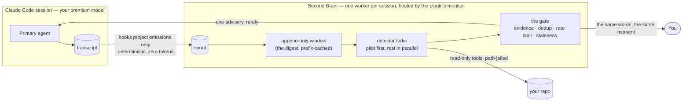

```
███████╗███████╗ ██████╗ ██████╗ ███╗   ██╗██████╗
██╔════╝██╔════╝██╔════╝██╔═══██╗████╗  ██║██╔══██╗
███████╗█████╗  ██║     ██║   ██║██╔██╗ ██║██║  ██║
╚════██║██╔══╝  ██║     ██║   ██║██║╚██╗██║██║  ██║
███████║███████╗╚██████╗╚██████╔╝██║ ╚████║██████╔╝
╚══════╝╚══════╝ ╚═════╝ ╚═════╝ ╚═╝  ╚═══╝╚═════╝
██████╗ ██████╗  █████╗ ██╗███╗   ██╗
██╔══██╗██╔══██╗██╔══██╗██║████╗  ██║
██████╔╝██████╔╝███████║██║██╔██╗ ██║
██╔══██╗██╔══██╗██╔══██║██║██║╚██╗██║
██████╔╝██║  ██║██║  ██║██║██║ ╚████║
╚═════╝ ╚═╝  ╚═╝╚═╝  ╚═╝╚═╝╚═╝  ╚═══╝
    a second pair of eyes on your Claude Code session · rare, gated, one-way advice
```

# Second Brain — Claude Code plugin

**A cheap background model that watches your session over its shoulder and, when — and
only when — it sees something worth saying, drops one short advisory into it:
asynchronously, without blocking, interrupting, or being asked.** It reads only the
agent's **emissions** — what it said and what it reached for, about **27 % of
conversation volume**, never its tool results — which is what makes it affordable to
leave running for every session instead of switching it on when you already suspect
trouble. It cannot block, veto, pause, edit, ask a question, or write anything to your
repository. The worst it can do is be wrong in a paragraph you ignore.

> Silence is the success metric. Most passes produce nothing. A chatty Second Brain is
> a broken one.

**Lineage:** part of the **[shofer.dev](https://shofer.dev)** Claude Code plugin family,
alongside [live-memory](https://github.com/shofer-dev/claude-code-live-memory) (codebase
memory) and [slang-workflows](https://github.com/shofer-dev/claude-code-slang-orchestrator)
(provable multi-agent workflows). The full reasoning — including what was evaluated and
rejected, and how this differs from Claude Code's built-in observer agents — is in
[`DESIGN.md`](DESIGN.md) · What leaves your machine: [`PRIVACY.md`](PRIVACY.md) · Known
gaps: [`TODO.md`](TODO.md).

## How it works



Hooks project the primary's transcript into a spool file — a deterministic, local
computation that costs zero tokens. The per-session worker (hosted by the plugin's own
monitor: no daemon, no service, nothing to install) tails that spool, keeps an
append-only, prefix-cached window of what it has seen, and every so often **forks that
window across a set of detectors** — each with its own system prompt and its own tool
grant, all sharing one cached prefix, a pilot fork warming the cache before the rest fan
out in parallel. Almost every fork returns *silent*. What does not gets gated hard —
evidence required, de-duplicated, rate-limited, re-checked for staleness — and what
survives is delivered as one paragraph of context beside a tool result **and shown to
you verbatim at the same moment**. When the primary's turn ends, a pass always runs
(the last cheap moment to look), and its verdicts reach *you only* — on the statusline
within seconds and as a report at your next interaction.

## Install

Requires the **interactive Claude Code CLI** (the worker is hosted by a plugin monitor,
which only interactive sessions start — headless surfaces are out of scope) and a
`python3` on the machine. Inside a session:

```
/plugin marketplace add shofer-dev/claude-code-second-brain
/plugin install second-brain@shofer-second-brain
```

Then restart the session so the hooks and the monitor load. That is the whole install:
no service, no port, no configuration file to write.

**Credentials.** Zero-config on a Claude subscription — if you are logged in with
`claude`, the observer reuses that credential (drawing on the subscription's rate-limit
budget, not metered API billing). To bill it separately, or to run somewhere else
entirely:

```
export ANTHROPIC_API_KEY=sk-…                       # metered, Anthropic
/second-brain-config set model.name claude-haiku-4-5-20251001

export OPENAI_API_KEY=…                             # or any OpenAI-compatible endpoint
/second-brain-config set model.provider openai
/second-brain-config set model.base_url https://api.deepseek.com/v1
/second-brain-config set model.name deepseek-chat
```

## What you will see

Most of the time, nothing. When the Second Brain does speak, it arrives twice in one
response — as context beside a tool result for the agent, and as a message to you with
the same words:

```
🧠 Second Brain · standard-questions (confidence 0.74)
No test run observed since the first edit 40 minutes ago.
Three new exported functions in services/foo/health.go; no test file touched.
Evidence: Write services/foo/health.go @L1; Edit services/foo/health_test.go — not observed
— mute with `/second-brain-config set detectors.standard-questions.enabled false`
```

Advice below the agent's confidence floor reaches **you only** — it never enters the
model's context — because a hunch too weak to spend the agent's attention on is still
worth a person's glance, and it is free.

Every time the primary's turn ends, the turn-end pass reports to you the same way —
never to the agent: a one-line outcome on the statusline within seconds (`last turn:
all silent`), and the full per-detector verdicts at your next interaction:

```
🧠 Second Brain — turn-end verdicts (not shown to the agent):
   [pass 7, 13:41] default → silent (checked: Read hello.py)
   [pass 7, 13:41] repeat-failure → silent
   [pass 7, 13:41] standard-questions → silent
```

## Commands

| Command | What it shows or does |
|---|---|
| `/second-brain-stats` | Observed vs dropped volume per tool, pass latency, window fill, token use and budget headroom, cost in money, advisories generated / gated / delivered, **uptake and KV-cache reads/writes per detector**, and the code version the worker is actually *running* beside the one installed — flagged when they differ |
| `/second-brain-run` | **Ask it to look now** — catches up from the transcript, runs one pass, prints every detector's verdict and any advisory. Bypasses the pass throttle, not the mute or the budget. The fastest way to see it work |
| `/second-brain-why` | The recent advisories with their evidence and adjudicated verdicts — **and the ones the gate dropped, with the reason** |
| `/second-brain-config` | Every threshold, cap and interval, with the layer each value came from; `set` validates before writing and running workers pick it up at the next pass boundary |
| `/second-brain-forget` | Drop a task ledger, a workspace's, or all of them |

Muting and debugging are configuration, not commands:

```
/second-brain-config set mute.all true                     # silence: no passes, no delivery,
                                                           # nothing sent (false to unmute);
                                                           # observation continues locally
/second-brain-config set detectors.<name>.enabled false    # mute one detector
/second-brain-config set debug.enabled true                # capture, per pass, the digest and
                                                           # every detector's whole loop under
                                                           # /tmp/second-brain/<session>/<pass>/
/second-brain-config set catalogue.file ~/my-detectors.json  # bring your own detector catalogue:
                                                           # copy the bundled detectors.json,
                                                           # edit, point here — it replaces the
                                                           # bundle; overrides still merge on top
```

### Reading status without spending a model turn

Every Claude Code slash command is a *prompt*: the `!` block runs, its output is
injected, and then the model is invoked to relay it. That is fine for a considered read
of `/second-brain-why`, and wrong for "is it watching, and what has it cost?" — a
question you want answered continuously and for free. Two paths avoid the model
entirely:

**The statusline** — the harness runs the command itself and prints what it returns.
Add to `settings.json` (the `$(…)` picks the latest installed version):

```json
"statusLine": {
  "type": "command",
  "command": "python3 \"$(ls -d ~/.claude/plugins/cache/shofer-second-brain/second-brain/*/ | sort -V | tail -1)statusline/statusline.py\""
}
```

It renders `🧠 watching · 3 passes · $0.04 · last turn: all silent`, and prints
**nothing** when no worker is watching — an empty segment is the honest display for
"not running".

**Bash mode** — type `!` in the prompt and the command runs in-session with its output
landing directly in the conversation, no turn:

```
!python3 "$(ls -d ~/.claude/plugins/cache/shofer-second-brain/second-brain/*/ | sort -V | tail -1)commands/sb.py" stats
```

## Detectors

A detector is its own system prompt, its own tool grant (empty by default), its own
schema and its own trigger — a catalogue entry, never a code path. The source of truth
is a JSON file you can read and edit (`worker/second_brain/detectors.json`), and
`catalogue.file` swaps in your own. Enabled out of the box:

| Detector | Watches for | Tools |
|---|---|---|
| `repeat-failure` | the same command failing three or more times with cosmetic variations | none *(the pilot — it warms the cache)* |
| `standard-questions` | checklist items the stream never answers — were the tests run? does it compile? — and it treats an explicit waiver ("no tests") as an answer | none |
| `default` | anything a competent watcher would flag: a mistake about to compound, a missed constraint, prior art about to be rebuilt | `Read`, `Grep`, `Glob` |

Defined and shipped **off**, one command each: `goal-drift`, `git-log` (reads history
via an exact `git log`/`git status` allowlist), `prior-art`, `constraint-drift`,
`cross-task-collision` (structural — the worker computes the collision, the model only
writes the advisory), and `static-analysis` — the only one that executes anything, and
it ships with an **empty** command allowlist you must fill:

```
/second-brain-config set detectors.git-log.enabled true
/second-brain-config set detectors.static-analysis.tools '[{"exec": ["go build ./..."]}]'
```

A detector can also be granted an **MCP server's** tools — a whole server or one tool —
if you configure it and the `mcp` Python SDK is installed:

```
/second-brain-config set mcp.servers '{"code-search": {"command": "my-search-mcp"}}'
/second-brain-config set detectors.prior-art.tools '["Grep", "Glob", {"mcp": "code-search"}]'
```

## What it costs

Observing costs **zero tokens** — the projection is a deterministic function of the
transcript computed locally, so a session that never triggers a pass costs nothing at
all. Only *judgment* costs, and the two knobs that decide how much are
`loop.min_interval_s` (how often it thinks) and `gate.rate_per_hour` (how often it
speaks). They are deliberately separate: making it think more often does not make it
chattier, and quietening it does not blind it.

The fan-out is built to be cache-cheap: every fork of a pass shares one byte-identical
prefix, the pilot writes it, and the rest read it — measured live as the pilot writing
4,230 tokens and both other detectors each reading exactly 4,230. `/second-brain-stats`
shows those reads and writes **per detector**, the **cost in money** (priced per model,
cache reads at 0.1× and writes at 1.25×), and the **measured observer-to-primary token
ratio**, read from the primary's own `usage` in the transcript rather than quoted from
this README. In a real session that ratio has run at **0.07 %**.

## Debugging

`/second-brain-config set debug.enabled true` makes each pass write, under
`/tmp/second-brain/<session>/<pass>/`, its `digest.txt` — the exact shared prefix every
detector fork received, ending at the cache breakpoint — and one `<detector>.txt` per
fork holding that fork's whole loop: its private input tail, every model reply and tool
call with its result, and its final output with token usage. Purely mechanical — no
model is involved in producing them — and it is how a confident-but-wrong advisory gets
adjudicated in four file reads.

## Safety properties

- **It cannot write.** The observer's file tools are `Read`, `Grep` and `Glob`,
  path-jailed to the session's working directory. Commands run only from an exact
  per-detector allowlist, re-checked at dispatch.
- **Nothing listens.** No daemon, no socket, no port, no token. State is files under
  `${CLAUDE_PLUGIN_DATA}`, created `0700`/`0600`.
- **Fail open, always.** If the worker is down, slow or misconfigured, the hooks no-op
  in milliseconds and your session is untouched.
- **You see everything the agent sees.** No advisory reaches the model without the same
  text reaching you in the same response — and the turn-end reports reach *only* you.
- **Enrolment is a decision.** In a workspace that has not opted in, the feed hook
  returns before it reads a transcript.

## Shape

```
second-brain/
├── .claude-plugin/            # plugin + marketplace manifests
├── hooks/                     # feed.py (project → spool) · drain.py (deliver + finish gate)
│   └── hooks.json
├── monitors/monitors.json     # hosts the worker for the session — the only worker host
├── commands/                  # sb.py + one .md per human surface (stats/run/why/config/forget)
├── statusline/statusline.py   # the model-free status segment
├── worker/
│   ├── run.py                 # entrypoint the monitor runs
│   └── second_brain/
│       ├── detectors.json     # THE detector catalogue — the SoT users copy and edit
│       ├── projection.py      # transcript → observations (deterministic, golden-tested)
│       ├── loop.py            # the observer loop: triggers, passes, fan-out, capture
│       ├── window.py          # the digest: append-only, prefix-cached, compacted to a ledger
│       ├── fork.py            # one detector fork: shared prefix + private tail + tool loop
│       ├── gate.py            # evidence, dedup, rate limit, staleness, mute
│       ├── ledger.py          # per-task durable judgment + GC
│       ├── provider.py        # Anthropic Messages | OpenAI-compatible, cache breakpoints
│       └── …                  # tools (path-jailed), mailbox, index, config, status, paths
├── tests/                     # fully offline: goldens, scripted-provider fixtures, gate sims
└── run-tests.sh               # compileall + pytest + manifest validation
```

## Development

```
./run-tests.sh          # compileall + pytest + manifest validation
```

The suite is fully offline: `tests/conftest.py` refuses both the provider factory and
the HTTP transport, so a test that reaches for a model fails rather than quietly
spending a real subscription's budget. Three layers, matching the design: projection
goldens (byte-exact), detector fixtures against a scripted provider, and gate
simulations with no model in the loop.

Working on the plugin itself: `claude --plugin-dir <path>` picks up source edits
(installed plugins are cached under `~/.claude/plugins/`).

## License

Apache-2.0. See [`LICENSE`](LICENSE).
